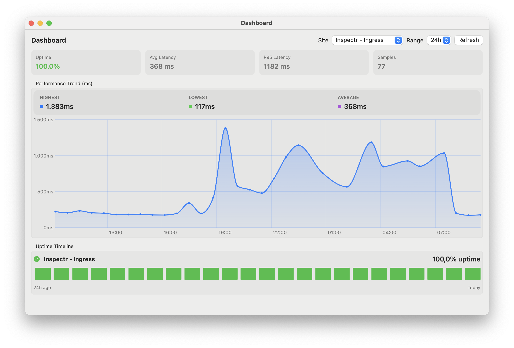
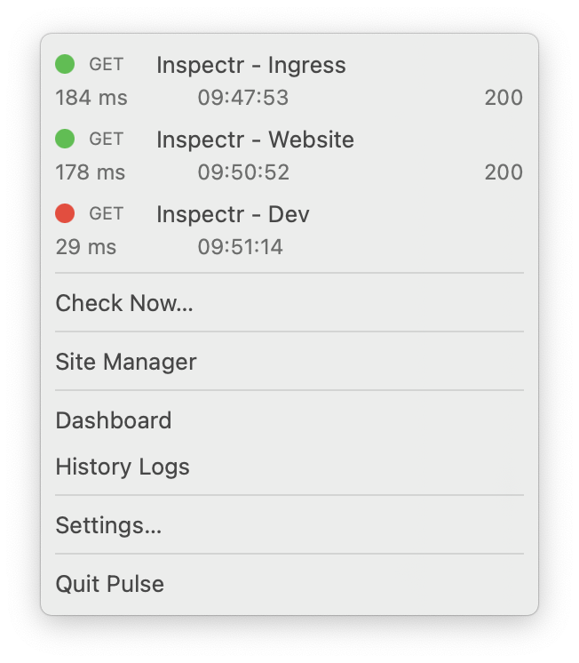
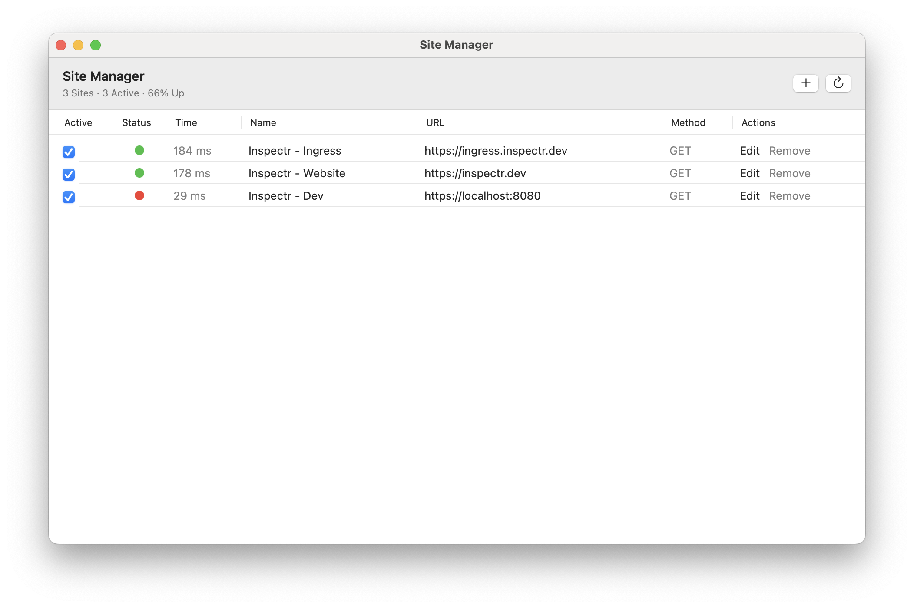
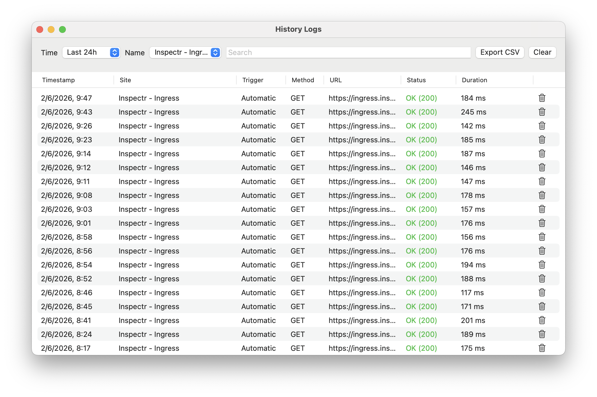
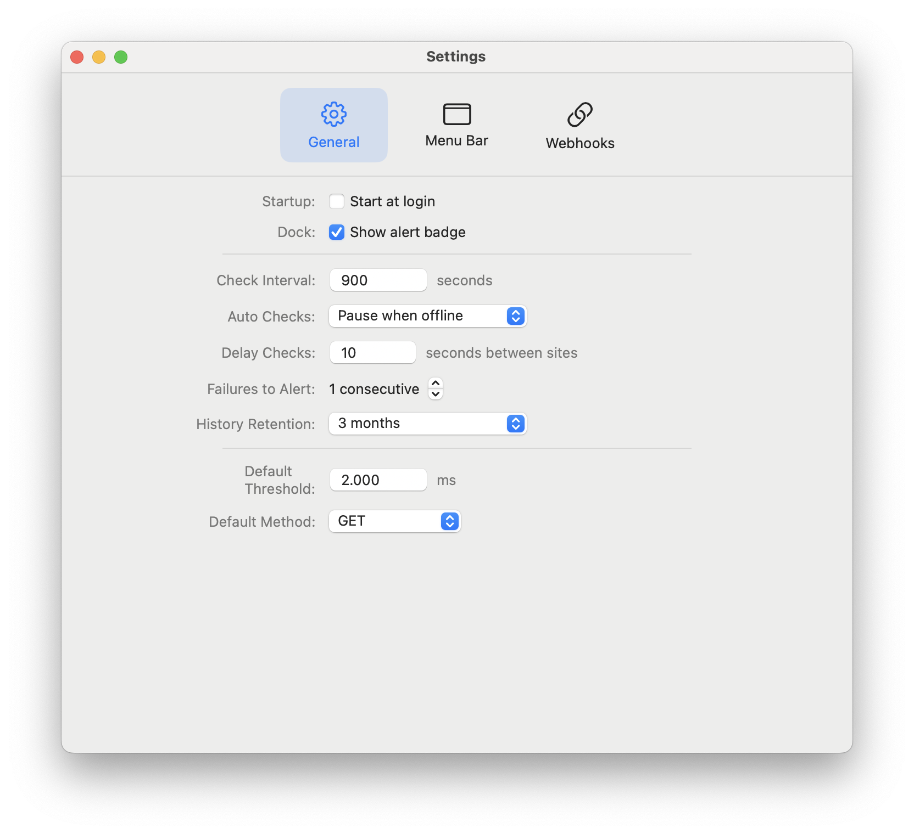

# Pulse

Pulse is a lightweight macOS menu bar uptime checker.

It gives you a fast, always-available way to monitor APIs, MCP servers, websites, and health endpoints from your Mac menu bar.




## Pulse Features

- Native macOS menu bar app (`SwiftUI`, `MenuBarExtra`, macOS 15+)
- Multi-site monitoring with per-site method/threshold/keyword
- Automatic checks (default every `900` seconds)
- Manual checks from menu and site manager
- Per-site pause/unpause
- History log persisted to Application Support JSON (atomic writes, ISO-8601 dates)
- Optional webhook transitions (`up -> down`, `down -> up` when enabled), with multiple webhook rules and per-site filters

## Screenshots

| Menu Bar | Site Manager | Dashboard | History Logs | Settings |
|----------|--------------|-----------|--------------|----------|
|  |  |  |  |  |

## Why Monitoring Matters

Small outages, DNS/TLS issues, or degraded response times are easy to miss until users report them.

Pulse helps you:
- catch regressions quickly after deploys
- verify service health during local development
- see response-time trends
- keep lightweight incident context in a local history log

## Get Started

### 1. Download Pulse

1. Open the [GitHub Releases](https://github.com/inspectr-hq/pulse/releases) page.
2. Download the latest macOS release zip file.
3. Extract it and move `Pulse.app` to your `Applications` folder.

### 2. First Launch on macOS

Pulse is an open-source project and release builds are distributed unsigned.
On first launch, macOS may show:
- `"Pulse" cannot be opened because Apple cannot check it for malicious software.`
- `"Pulse" is damaged and can't be opened. You should move it to the Bin.`

To run it anyway:
1. In Finder, right-click `Pulse.app` and choose `Open`.
2. Click `Open` again in the warning dialog.

If Finder still blocks it, use:

- `System Settings -> Privacy & Security` and click `Open Anyway` for Pulse.

Alternative Terminal path:

```bash
xattr -dr com.apple.quarantine /path/to/Pulse.app
open /path/to/Pulse.app
```

If needed, remove all extended attributes and try again:

```bash
xattr -cr /path/to/Pulse.app
open /path/to/Pulse.app
```

### 3. Add Your First Site

1. Launch Pulse.
2. Open `Site Manager` from the menu bar.
3. Add a site and run a manual check.

## Setting Options

This section documents each setting and whether it currently has active runtime behavior.

### General

- `Start at login`
  - Behavior: Calls `SMAppService.mainApp.register()` / `unregister()` when settings are saved.

- `Show alert badge`
  - Behavior: Shows a Dock badge count for enabled monitors that are down, or up but slower than `Default Threshold`.

- `Ping Interval (seconds)`
  - Behavior: Reschedules periodic automatic checks using `MonitorScheduler`.

- `Auto Checks`
  - Behavior: `Pause when offline` skips automatic scheduler checks while macOS reports no active internet path. Manual checks always run.

- `Delay Checks (seconds between sites)`
  - Behavior: Adds delay between each monitor check in batch runs (`checkAll`) to reduce burst traffic and rate-limit pressure.

- `Failures to Alert (consecutive)`
  - Behavior: Alerting is gated until the same monitor fails N consecutive checks. Recovery can alert once the monitor returns up.

- `Default Threshold (ms)`
  - Behavior: Used as the initial threshold value for newly added monitors.

- `Default Method`
  - Behavior: Used as the initial HTTP method for newly added monitors.

### Menu Bar

- `Menu Items: Max N`
  - Behavior: Limits number of monitor rows rendered in dropdown (`prefix(maxItems)`).

- `Menu Icon: Show status color`
  - Behavior: If disabled, menu bar icon is rendered monochrome.

- `Colorize Icon` (`Always`, `Only failing`, `Never`)
  - Behavior:
    - `Always`: icon reflects current overall status color.
    - `Only failing`: icon is colored only for `down` state.
    - `Never`: icon is monochrome.

- `Show method`
  - Behavior: Shows/hides HTTP method in each dropdown row.

- `Show response time`
  - Behavior: Shows/hides response-time line in dropdown rows.

- `Show last checked`
  - Behavior: Shows/hides last checked time line in dropdown rows.

- `Show status code`
  - Behavior: Shows/hides HTTP status code in dropdown rows.

- `Status Colors` (`Up`, `Slow`, `Failure`, `Offline`)
  - Behavior: Applied to status dots in menu/site manager/history and to menu bar icon coloring when icon color mode allows it.

### Webhooks

- `Enable Webhooks`
  - Status: Implemented
  - Behavior: Enables webhook engine for alerting/recovery transitions (also gated by `Failures to Alert`).

- `Webhook Rules (multiple)`
  - Status: Implemented
  - Behavior: Configure multiple webhook endpoints, each with its own method/payload/retry policy.

- `Site Filter`
  - Status: Implemented
  - Behavior: Each webhook rule can target `All sites` or only selected monitors.

- `Send On` (`Alerting`, `Alerting and Recovery`)
  - Status: Implemented
  - Behavior:
    - `Alerting`: sends on `up -> down`
    - `Alerting and Recovery`: also sends on `down -> up`

- `Webhook URL`
  - Status: Implemented
  - Behavior: Required destination URL; empty/invalid URL disables send.

- `Method` (`POST`, `GET`)
  - Status: Implemented
  - Behavior: Sets webhook request method.

- `Payload`
  - Status: Implemented
  - Behavior: Template placeholders are replaced before send.

- `Retries`
  - Status: Implemented
  - Behavior: Retries failed webhook requests with exponential backoff.

- `Initial Backoff`
  - Status: Implemented
  - Behavior: Base delay in seconds used for retry backoff.

- Supported payload placeholders:
  - `$MESSAGE`, `$MONITOR`, `$STATUS`, `$URL`, `$TRIGGER`, `$STATUS_CODE`, `$RESPONSE_MS`, `$TIMESTAMP`

### History

- `History retention` (`1h`, `1d`, `1m`, `3m`, `Unlimited`)
  - Status: Implemented
  - Behavior: Applies rolling time-window pruning when new history events are appended.
  - Default: `1m`

## Runtime Rules (Current)

- `HEAD` checks fall back to `GET` when `405` or `501` is returned.
- Up status code range: `200...399`.
- Down status code range: `400...599` (and network/TLS/DNS/timeouts).
- Automatic scheduler checks only enabled monitors.
- Automatic scheduler checks can be paused when offline if `Auto Checks` is set to `Pause when offline`.
- Paused monitors are skipped by automatic checks.
- Manual checks can check paused monitors; UI status remains `Paused`, but real result is stored in history as a `manual` event.
- Batch checks can be delayed between sites using `Delay Checks`.
- Alert transitions are threshold-gated by `Failures to Alert`.
- Overall status logic:
  - `down` if any enabled monitor is down
  - `checking` if any enabled monitor is checking and none are down
  - `up` if at least one enabled monitor is up and none are down/checking
  - `unknown` if enabled monitors exist and none has a completed check yet
  - `neutral` if no enabled monitors


## Build & Test

From repository root:

```bash
cd app
swift build
swift test
```

## Relationship to Inspectr

Pulse is a focused local utility in the Inspectr ecosystem. It complements broader tooling from [inspectr.dev](https://inspectr.dev/) with quick desktop monitoring during development and operations.
